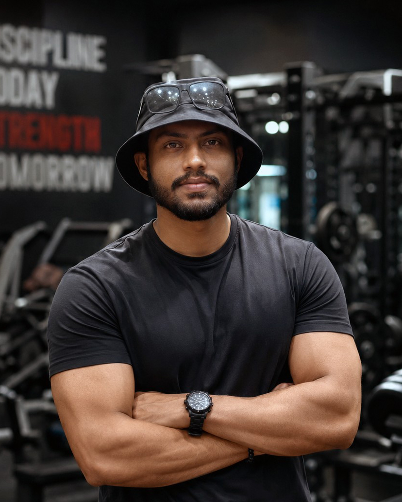

<div align="center">


# 🚀 Building High-Performance Digital Experiences

### Founded & Led by **Deneth Silva** — Full-Stack Developer, UI/UX Designer & Fitness Coach

<p align="center">
  <a href="https://deetage.lk" target="_blank">
    
  </a>
  <a href="mailto:support@deetage.lk">
    
  </a>
  <a href="https://wa.me/94703045555" target="_blank">
    
  </a>
</p>

<p align="center">
  <a href="https://denethsilva.lk" target="_blank">
    
  </a>
  <a href="mailto:hello@denethsilva.lk">
    
  </a>
</p>

<br>

<a href="#-meet-the-founder">Founder</a> •
<a href="#-our-business-structure">Businesses</a> •
<a href="#-core-capabilities">Capabilities</a> •
<a href="#-services">Services</a> •
<a href="#-advanced-technology-stack">Tech Stack</a> •
<a href="#%EF%B8%8F-how-we-build">Process</a> •
<a href="#-featured-digital-projects">Projects</a> •
<a href="#-currently-available">Contact</a>

</div>

---

## 👨‍💻 Meet the Founder

<div align="center">



### **Deneth Silva**

#### Founder & CEO — Deetage Studio Pvt Ltd

**Full-Stack Developer | UI/UX Designer | Digital Product Builder | Fitness Coach**

*Designing, developing and managing digital products from concept to production.*

</div>

---

### 💼 Professional Profile

**Deneth Silva** is the founder and lead developer behind **Deetage Studio Pvt Ltd**, a digital development and UI/UX-focused company dedicated to building modern, high-performance digital experiences.

With hands-on experience across **web development, UI/UX design, e-commerce, performance optimisation, SEO, cloud deployment and digital product development**, Deneth manages the complete development lifecycle — from initial concept and interface design to development, deployment, optimisation and ongoing improvement.

Beyond Deetage Studio, Deneth independently operates and manages the digital side of two additional ventures:

* **Deetage Pvt Ltd** — A performance apparel and clothing brand, where Deneth personally handles the complete digital development, e-commerce technology, website management, UI/UX and technical infrastructure.
* **Deneth Silva Personal Training** — A personal training and online coaching brand operated under Deneth's own name, with its website and digital coaching platform personally designed and developed.

This combination of **technology, design, business and fitness industry experience** allows Deneth to approach digital products not only from an engineering perspective, but also from a real-world business and customer experience perspective.

<div align="center">


</div>

---

## 🏢 Our Business Structure

<div align="center">

### **Deetage Studio Pvt Ltd**

#### Web Development • UI/UX • Digital Products • SEO • Performance

</div>

**Deetage Studio Pvt Ltd** is the technology and digital development company led by Deneth Silva.

The studio focuses on creating modern digital experiences for businesses, brands and individuals — including websites, web applications, e-commerce platforms, dashboards, client portals and custom digital systems.

<br>

| | |
|---|---|
| 👕 **Deetage Pvt Ltd** | **Deetage Silva Personal Training** 🏋️ |
| Performance apparel & clothing brand. Deneth personally handles the entire digital and technology side — website, e-commerce, product systems, admin systems, SEO, performance, deployment and technical maintenance. | Personal fitness coaching brand operated independently under Deneth's own name — online coaching, strength & fat-loss programming, progress tracking and client check-ins. |
| 🌐 **[deetage.lk](https://deetage.lk)** | 🌐 **[denethsilva.lk](https://denethsilva.lk)** |

Deneth is not simply running a portfolio project on either brand — both are real-world business environments where he develops, manages and continuously improves the complete digital ecosystem.

---

### 👕 Deetage Pvt Ltd

**Deetage Pvt Ltd** is the clothing and performance apparel business behind **Deetage**.

The business focuses on:

* Performance Apparel
* Fitness Clothing
* Men's & Women's Wear
* Nutrition
* Fitness Accessories
* E-commerce

**Website Development → UI/UX → E-commerce → Product Systems → Admin Systems → SEO → Performance → Deployment → Technical Maintenance**

🌐 **[https://deetage.lk](https://deetage.lk)**

---

### 🏋️ Deneth Silva — Personal Training

**Deneth Silva Personal Training** is Deneth's personal fitness coaching brand, operated independently under his personal name.

The platform focuses on:

* Personal Training
* Online Coaching
* Strength Development
* Muscle Building
* Fat Loss
* Nutrition Guidance
* Workout Programming
* Progress Tracking
* Client Check-ins
* Long-Term Fitness Consistency

The complete digital presence — including the website, UI/UX, technical architecture and online coaching experience — is personally designed and developed by Deneth.

🌐 **[https://denethsilva.lk](https://denethsilva.lk)**

---

## 🌐 What We Do

We don't just build websites.

**We design, engineer and manage complete digital products that are built around real business goals.**

From a high-converting landing page to a full-scale e-commerce platform or custom web application, Deetage Studio combines **modern engineering, premium UI/UX, performance optimisation, SEO and scalable architecture** to create digital experiences that are fast, reliable and built for growth.

Our approach covers the complete lifecycle:

**Strategy → UI/UX → Development → Testing → SEO → Performance → Deployment → Maintenance → Continuous Improvement**

---

## 🚀 Core Capabilities

| ⚡ Performance Engineering | 🎨 UI/UX Design | 🔎 Search Optimisation | 🔒 Security & Scalability |
| :--- | :--- | :--- | :--- |
| Fast loading, Core Web Vitals & efficient architecture. | Clean, modern, responsive and user-focused interfaces. | Optimisation for Google, Microsoft Bing and other major search engines. | Secure architecture designed to scale with business requirements. |

| 🧠 Full-Stack Development | 🛒 E-Commerce | ☁️ Cloud & Deployment | 📊 Digital Systems |
| :--- | :--- | :--- | :--- |
| Modern frontend, backend, APIs and databases. | Complete online stores, product systems and checkout experiences. | Production deployments, CI/CD and cloud infrastructure. | Dashboards, client portals, authentication and business tools. |

---

## 🧰 Services

<details open>
<summary><strong>🌐 Full-Stack Web Development</strong></summary>
<br>

Custom-built web applications using modern technologies.

* Business Websites
* SaaS Applications
* Client Portals
* Admin Dashboards
* E-Commerce Platforms
* Membership Systems
* Booking Systems
* Custom Web Applications

</details>

<details>
<summary><strong>🎨 UI/UX Design</strong></summary>
<br>

Designing interfaces that are visually strong while remaining practical and easy to use.

* UI Design
* UX Architecture
* Responsive Design
* Design Systems
* User Flows
* Wireframes
* Prototyping
* Mobile & Desktop Experiences

</details>

<details>
<summary><strong>🛒 E-Commerce Development</strong></summary>
<br>

Complete digital commerce experiences designed around the business.

* Product Management
* Shopping Cart
* Checkout
* Customer Accounts
* Order Management
* Payment Integration
* Inventory Systems
* Admin Panels

</details>

<details>
<summary><strong>🔎 SEO & Search Visibility</strong></summary>
<br>

Technical and on-page optimisation designed to improve visibility across major search engines, including Google, Microsoft Bing and other major search platforms.

Focus areas include:

* Technical SEO
* Metadata
* Structured Data / Schema
* Semantic HTML
* Search-friendly architecture
* Site performance
* Core Web Vitals
* Crawlability
* Indexability
* Open Graph
* XML Sitemaps
* Robots.txt
* Canonical URLs

</details>

<details>
<summary><strong>⚡ Performance Optimisation</strong></summary>
<br>

Building websites that are engineered for speed.

* Core Web Vitals
* Image Optimisation
* Code Splitting
* Lazy Loading
* Server-Side Rendering
* Static Generation
* Caching
* CDN Delivery
* Efficient API Architecture
* Bundle Optimisation

</details>

<details>
<summary><strong>🔌 API & Backend Integration</strong></summary>
<br>

Connecting modern interfaces with powerful backend systems.

* REST APIs
* Authentication
* Database Architecture
* Payment Gateways
* Headless CMS
* Webhooks
* Third-Party APIs
* Serverless Functions

</details>

---

## 🧠 Advanced Technology Stack

<div align="center">


<br><br>


</div>

### ⚙️ Modern Production Stack

Our preferred architecture can combine technologies such as:

| Layer | Technologies |
| :--- | :--- |
| **Frontend** | `Next.js` • `React` • `TypeScript` • `Tailwind CSS` |
| **Backend** | `Node.js` • `API Routes` • `Serverless Functions` • `REST APIs` • `GraphQL` |
| **Database** | `PostgreSQL` • `Supabase` • `MongoDB` • `Prisma` • `Redis` |
| **Authentication & Security** | `Supabase Auth` • `OAuth` • `JWT` • `Cloudflare` • `Cloudflare Turnstile` |
| **Cloud & Infrastructure** | `Vercel` • `AWS` • `Cloudflare` • `Docker` • `CDN` |
| **Development & Collaboration** | `Git` • `GitHub` • `VS Code` • `Figma` |
| **CMS & Content** | `Sanity` • `Headless CMS` • `WordPress` |
| **Payments & Commerce** | `Stripe` • `Payment APIs` • `E-Commerce Integrations` |

> Technology is selected according to the requirements of each project rather than forcing every project into the same stack.

---

## 🏗️ How We Build

Our development process is designed to take a project from an idea to a production-ready digital product.

```text
01 — DISCOVER      → Business Goals & Requirements
02 — PLAN          → Architecture & Technical Strategy
03 — DESIGN        → UI/UX & User Experience
04 — DEVELOP       → Frontend + Backend + Database
05 — TEST          → Quality Assurance + Responsive Testing
06 — OPTIMISE      → Performance + SEO + Accessibility
07 — DEPLOY        → Cloud Deployment + Production Setup
08 — IMPROVE       → Monitoring + Maintenance + Continuous Development
```

---

## 📈 Performance & SEO Philosophy

A modern website should not only **look good**. It should:

* Load quickly
* Work across devices
* Be accessible
* Be easy for search engines to understand
* Provide a smooth user experience
* Be secure
* Be maintainable
* Be scalable
* Support real business objectives

Our development approach combines **technical performance, user experience and search visibility** from the beginning rather than treating them as an afterthought.

---

## 🔐 Security & Reliability

Security is considered throughout the development lifecycle. Areas may include:

* Secure authentication
* Protected API routes
* Environment variable management
* Database security
* Input validation
* Rate limiting
* Bot protection
* Cloudflare protection
* Secure payment integrations
* HTTPS
* Access control
* Secure deployment practices

See our [Security Policy](./SECURITY.md) for how to responsibly report a vulnerability.

---

## 📱 Responsive by Design

Every digital experience should work properly across modern devices.

Our interfaces are designed and tested for:

**Desktop → Laptop → Tablet → Mobile**

with responsive layouts, touch-friendly interactions and performance-conscious implementation.

---

## 📊 GitHub Stats & Activity

<div align="center">


</div>

<br>

<div align="center">


</div>

---

## 🏆 Featured Digital Projects

<div align="center">

| Project | Description | Role |
| :--- | :--- | :--- |
| 👕 **[Deetage — Performance Apparel](https://deetage.lk)** | The official digital platform for Deetage, a performance apparel and fitness-focused clothing brand operated by Deetage Pvt Ltd. Includes e-commerce functionality, product management, customer experiences and business-focused digital systems. | Founder / Business Owner / Full Digital Development |
| 🏋️ **[Deneth Silva — Personal Training](https://denethsilva.lk)** | A personal brand and online coaching platform for personal training, fitness programming and online coaching. | Founder / Coach / UI/UX / Full-Stack Development |
| 💻 **Deetage Studio** | The technology and digital development company responsible for building modern web experiences, UI/UX systems and digital products. | Founder / Full-Stack Developer / UI/UX Designer |

</div>

---

## 🌍 Sri Lanka → Worldwide

<div align="center">

### 🇱🇰 Based in Sri Lanka &nbsp;•&nbsp; 🌍 Building for Businesses Worldwide

</div>

Deetage Studio is built with a global mindset — combining modern web technologies, international development standards and business-focused digital experiences while operating from Sri Lanka.

---

## 🤝 Contributing

Interested in contributing, reporting a bug, or suggesting a feature? Please read our [Contributing Guide](./CONTRIBUTING.md) and [Code of Conduct](./CODE_OF_CONDUCT.md) first.

---

## 💼 Currently Available

<div align="center">

### ✅ Available for New Projects

**Web Development • UI/UX • E-Commerce • SEO • Digital Products**

If you have a business, brand or digital idea that needs to become a professional online experience, let's build it.

<br>

<a href="https://deetage.lk" target="_blank">
  
</a>
<a href="mailto:support@deetage.lk">
  
</a>
<a href="https://wa.me/94703045555" target="_blank">
  
</a>

</div>

---

## 👤 Connect With Deneth

<div align="center">

**Personal Training • Fitness Coaching • Digital Development**

<a href="https://denethsilva.lk" target="_blank">
  
</a>
<a href="mailto:hello@denethsilva.lk">
  
</a>

</div>

---

<div align="center">


<br><br>

### **Built with purpose. Designed for performance. Engineered for growth.**

**Deetage Studio Pvt Ltd © 2026**

</div>


